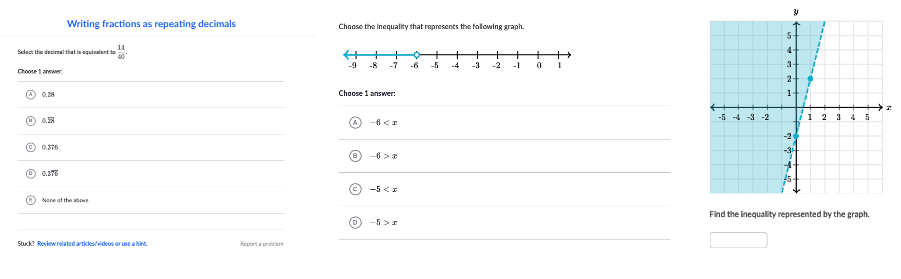

# Perseus


<p align="center"></p>

<p align="center"><strong>Perseus Exercise Renderer</strong></p>

Perseus is Khan Academy's exercise system. This repo contains the code needed to take a problem in the Perseus format and present it, allow interaction, and grade the result of a learner's work.

<p align="center"></p>

## Development

Perseus is a monorepo - a single repository that ships multiple npm packages. Generally you can treat Perseus as a single code base; things should generally just work as you expect them to during the development process. We use scripts and a tool called changesets to keep package inter-dependencies organized, release the one repo to multiple npm packages, and version changes appropriately.

For a slightly more detailed overview, see the ["Shipping a Change to Perseus"] document in Confluence.

["Shipping a Change to Perseus"]: https://khanacademy.atlassian.net/wiki/spaces/LC/pages/2384887922/Shipping+a+Change+to+Perseus

### Prerequisites

- [Node.js v20](https://nodejs.org/en/blog/announcements/v20-release-announce)
- [pnpm](https://pnpm.io/)

### Getting started

```bash
ka-clone git@github.com:Khan/perseus
pnpm install
```

### Branching strategy

Our shared development branch is `main`. **`main` should always be releasable**. Don't land changes to `main` that you're not ready to ship!

To make changes to Perseus, create a new branch based on `main`, commit your changes, and open a pull request on GitHub.

### Everyday commands

```bash
pnpm tsc -w                  # run the typechecker in watch mode
pnpm test                    # run all tests
pnpm lint                    # find problems
pnpm lint --fix              # fix problems
pnpm storybook               # open component gallery
pnpm changeset               # create a changeset file (see below)
pnpm update-catalog-hashes   # update catalog dependency hashes (see below)
```

Additionally, we use Khan Academy's Git extensions (OLC) to manage pull requests.

```bash
git pr    # open a pull request for the current branch
git land  # land the pull request for the current branch
```

### Using Storybook

The components and widgets of Perseus are developed using [Storybook](https://github.com/storybookjs/storybook). After you clone the project and get dependencies installed, the next step is to start storybook by running `pnpm storybook`. This will start a server and give you a playground to use each component.

### Using Changesets

We use [changesets](https://github.com/changesets/changesets) to help manage our versioning/releases. Each pull request must include a changeset file stating which packages changed and how their versions should be incremented. Run `pnpm changeset` to generate and commit a changeset file.

### Catalog Hashes

Catalog hashes ensure packages are republished when their catalog dependencies (Wonder Blocks, React, etc.) are updated. When a catalog dependency version changes, the hash changes, signaling that affected packages should be version-bumped and republished even if their source code hasn't changed. These hashes are automatically updated when running `utils/sync-dependencies.ts`. If you manually add catalog dependencies to a package.json, run `pnpm update-catalog-hashes` to update the hashes. The pre-publish check will verify all hashes are current before releasing.

### Releasing Perseus to npm

1. Landing changes to `main` creates/updates a “Version Packages” PR
2. To cut a Perseus release, approve and land the “Version Packages” PR
   (typically with `git land`)
3. ☢️ If the CI/CD checks aren’t running, you might need to close and reopen the PR
4. After the release script runs, you should see the new releases on the [release page](https://github.com/Khan/perseus/releases)

### Random notes

- We use `v8` to track Jest coverage. There's some old legacy code that we don't want coverage for, so we ignore that with `c8 ignore`. It might look like `c8` isn't be used, but it's used by the `v8` `coverageProvider` (defined in config/test/test.config.js).

## Contributing

The Perseus project is not accepting external contributions. We’re releasing the code for others to refer to and learn from, but we are not open to pull requests or issues at this time.

## License

[MIT License](http://opensource.org/licenses/MIT)
