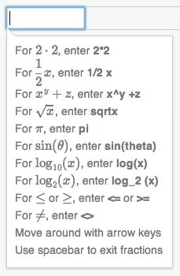
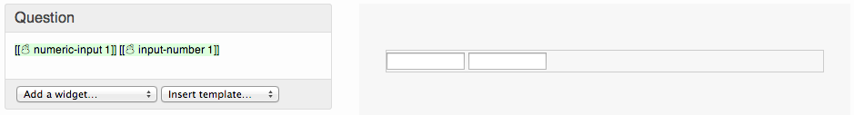
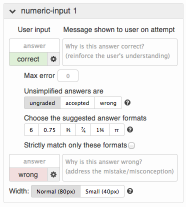
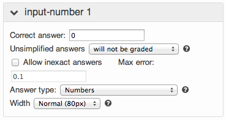

# Math Input Menagerie

## Components

### `InputWithExamples`

A `MathInput` or `TextInput` that has an acceptable formats popover.

Used in three widgets - `Expression`, `NumericInput`, and `InputNumber`.

#### `MathInput`

A [MathQuill](https://github.com/Khan/mathquill) React component. *Only* used in `InputWithExamples`.

#### `TextInput`

An `<input type="text">` with better semantics. Calls `onChange` directly with the new value (instead of the event) and provides a `.focus()` method. Used in `InputWithExamples` and `ExampleWidget`.

### `NumberInput`

This is used in `NumericInput` as well as several other widgets.

```
Calls onChange(value, format) for valid numbers.

Reverts to the current value onBlur or on [ENTER],
  but maintains the format (i.e. 3/2, 1 1/2, 150%)
   
Accepts empty input and sends it to onChange as null
  if no numeric placeholder is set.
  
If given a checkValidity function, will turn
  the background/outline red when invalid
  
If useArrowKeys is set to true, up/down arrows will
  increment/decrement integers
  
Optionally takes a size ("mini", "small", "normal")
```

## Widgets

### `Expression` (and `OldExpression`)

Widget called "Expression / equation" that is in the process of being upgraded.

The newer version is composed of a React component called `Expression` that uses MathQuill for WYSIWYG expression input (it wraps `InputWithExamples`, which in turn wraps `MathInput`). This version is now the default for most browsers.



The older version is composed of a React component called `OldExpression` that uses a plain text input, and displays a live render of the last parsed TeX immediately below. This version is now only served to mobile web browsers, since MathQuill's mobile support is still rough around the edges. Eventually, this version will be deprecated entirely.


### `InputNumber`

Widget called "Number text box" for simple number entry.

### `NumericInput`

A newer version of `InputNumber`. This looks exactly the same to the user:



... but `NumericInput` is more sophisticated behind the scenes than `InputNumber`.



